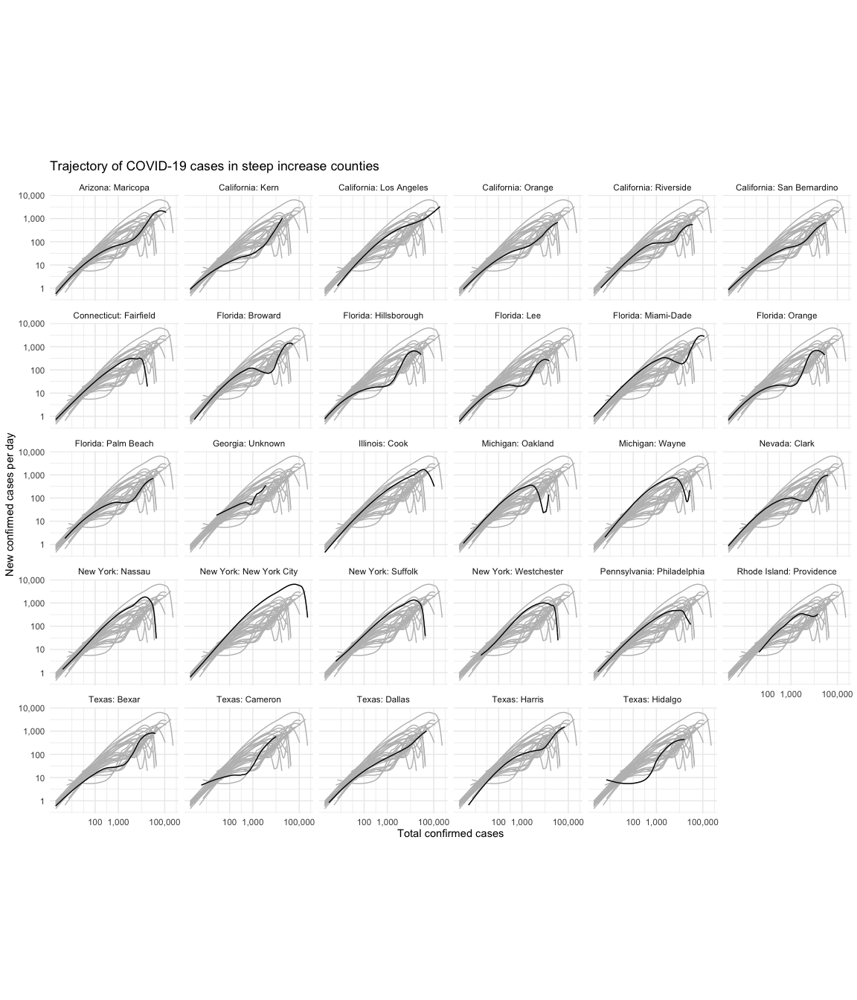
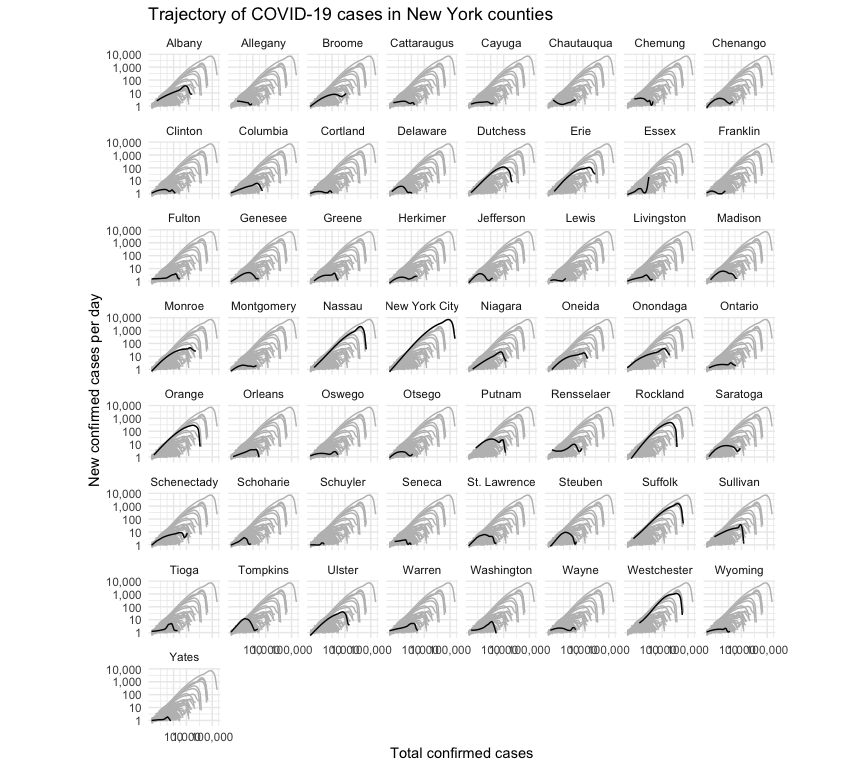
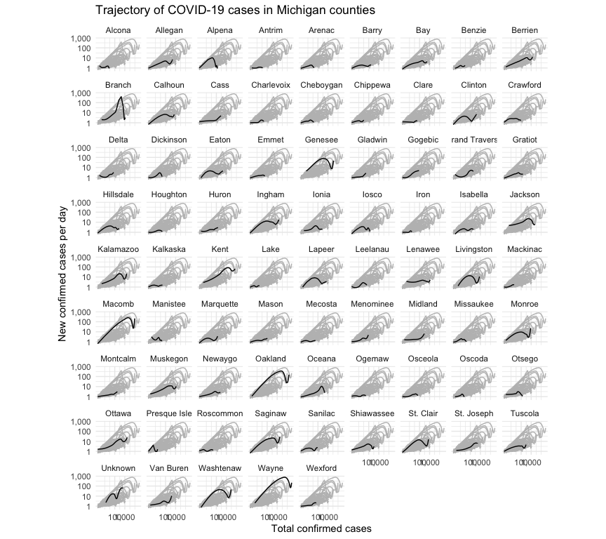
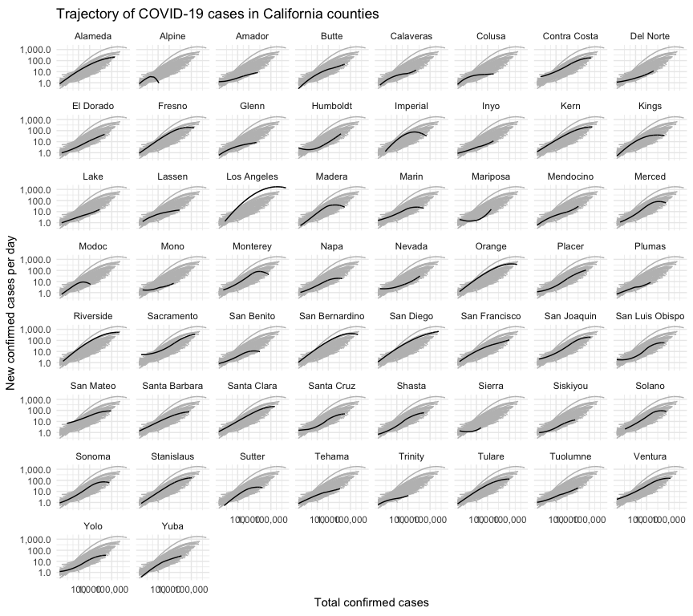
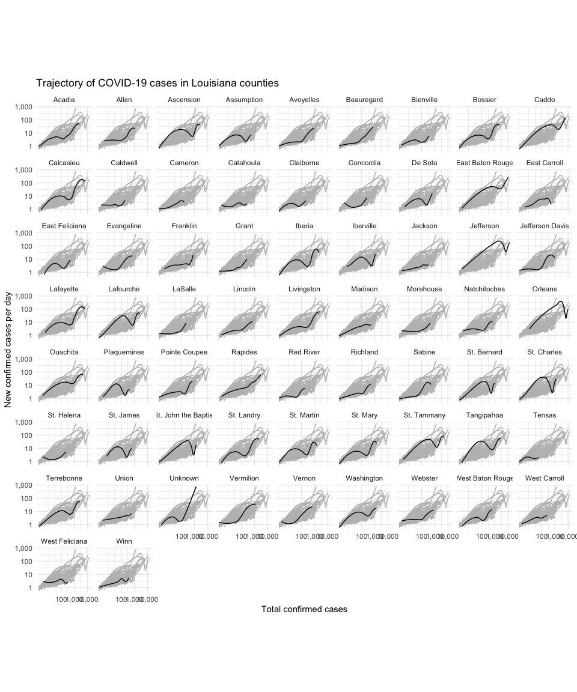
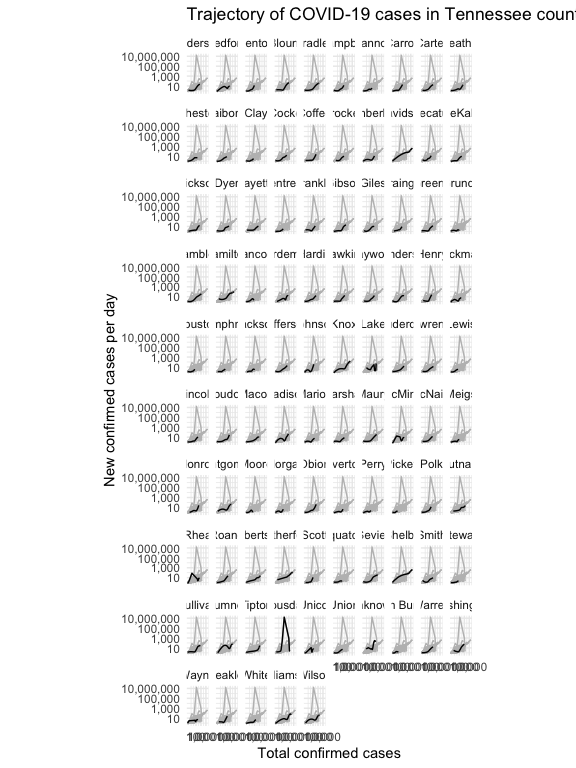

I noticed counties with protests had a double-hump shape.  I wanted to compare this shape with other counties in the same state.


```
## ── Attaching packages ──────────────────────────────────────────────── tidyverse 1.3.0 ──
```

```
## ✔ ggplot2 3.2.1     ✔ purrr   0.3.3
## ✔ tibble  2.1.3     ✔ dplyr   0.8.5
## ✔ tidyr   1.0.2     ✔ stringr 1.4.0
## ✔ readr   1.3.1     ✔ forcats 0.5.0
```

```
## ── Conflicts ─────────────────────────────────────────────────── tidyverse_conflicts() ──
## ✖ dplyr::filter() masks stats::filter()
## ✖ dplyr::lag()    masks stats::lag()
```

```
## 
## Attaching package: 'scales'
```

```
## The following object is masked from 'package:purrr':
## 
##     discard
```

```
## The following object is masked from 'package:readr':
## 
##     col_factor
```

## Loading data


```r
covidByCounty <- loadCovidDataByGeo("US_COUNTY")
```

## Steep increase counties

Counties that ever hit 1,000 new cases per day.

```r
steepIncrease <- covidByCounty %>% dplyr::filter(newCasesPerDay > 1000) %>% dplyr::filter(state != "_ALL_")
steepIncreaseNames <- unique(steepIncrease$state)
steepIncreaseNames
```

```
##  [1] "Arizona: Maricopa"          "California: Kern"          
##  [3] "California: Los Angeles"    "California: Orange"        
##  [5] "California: Riverside"      "California: San Bernardino"
##  [7] "Connecticut: Fairfield"     "Florida: Broward"          
##  [9] "Florida: Hillsborough"      "Florida: Lee"              
## [11] "Florida: Miami-Dade"        "Florida: Orange"           
## [13] "Florida: Palm Beach"        "Georgia: Unknown"          
## [15] "Illinois: Cook"             "Michigan: Oakland"         
## [17] "Michigan: Wayne"            "Nevada: Clark"             
## [19] "New York: Nassau"           "New York: New York City"   
## [21] "New York: Suffolk"          "New York: Westchester"     
## [23] "Pennsylvania: Philadelphia" "Rhode Island: Providence"  
## [25] "Texas: Bexar"               "Texas: Dallas"             
## [27] "Texas: Harris"              "Texas: Hidalgo"
```


```r
plotData <- covidByCounty %>%
  dplyr::filter(state %in% steepIncreaseNames)
```


```r
ggplot(plotData, aes(x=cases, y=smoothed, group = state)) +
    geom_line(data = plotData %>% rename(group = state),
              aes(x = cases, y = smoothed, group = group), color = "grey") +
    geom_line(aes(y = smoothed), color = "black") +
    scale_x_log10(label = comma, breaks = c(100, 1000, 100000)) + 
    scale_y_log10(label = comma) +
    coord_equal() +
    labs(x = 'Total confirmed cases',
         y = 'New confirmed cases per day',
         title = 'Trajectory of COVID-19 cases in steep increase counties') +
    facet_wrap(~ state) +
    theme_minimal()
```

<!-- -->
## New York


```r
plotData <- covidByCounty %>%
  dplyr::filter(us_state=="New York")
```


```r
ggplot(plotData, aes(x=cases, y=smoothed, group = state)) +
    geom_line(data = plotData %>% rename(group = county),
              aes(x = cases, y = smoothed, group = group), color = "grey") +
    geom_line(aes(y = smoothed), color = "black") +
    scale_x_log10(label = comma, breaks = c(100, 1000, 100000)) + 
    scale_y_log10(label = comma) +
    coord_equal() +
    labs(x = 'Total confirmed cases',
         y = 'New confirmed cases per day',
         title = 'Trajectory of COVID-19 cases in New York counties') +
    facet_wrap(~ county) +
    theme_minimal()
```

<!-- -->

## Michigan


```r
plotData <- covidByCounty %>%
  dplyr::filter(us_state=="Michigan")
```


```r
ggplot(plotData, aes(x=cases, y=smoothed, group = state)) +
    geom_line(data = plotData %>% rename(group = county),
              aes(x = cases, y = smoothed, group = group), color = "grey") +
    geom_line(aes(y = smoothed), color = "black") +
    scale_x_log10(label = comma, breaks = c(100, 1000, 100000)) + 
    scale_y_log10(label = comma) +
    coord_equal() +
    labs(x = 'Total confirmed cases',
         y = 'New confirmed cases per day',
         title = 'Trajectory of COVID-19 cases in Michigan counties') +
    facet_wrap(~ county) +
    theme_minimal()
```

<!-- -->


## California


```r
plotData <- covidByCounty %>%
  dplyr::filter(us_state=="California")
```


```r
ggplot(plotData, aes(x=cases, y=smoothed, group = state)) +
    geom_line(data = plotData %>% rename(group = county),
              aes(x = cases, y = smoothed, group = group), color = "grey") +
    geom_line(aes(y = smoothed), color = "black") +
    scale_x_log10(label = comma, breaks = c(100, 1000, 100000)) + 
    scale_y_log10(label = comma) +
    coord_equal() +
    labs(x = 'Total confirmed cases',
         y = 'New confirmed cases per day',
         title = 'Trajectory of COVID-19 cases in California counties') +
    facet_wrap(~ county) +
    theme_minimal()
```

<!-- -->

## Louisiana

No protests against lockdown in Tennessee but I am curious how it looks.  I removed Bledsoe county because it seems to have a data error (100 million new cases on one day).


```r
plotData <- covidByCounty %>%
  dplyr::filter(us_state=="Louisiana")
```


```r
ggplot(plotData, aes(x=cases, y=smoothed, group = state)) +
    geom_line(data = plotData %>% rename(group = county),
              aes(x = cases, y = smoothed, group = group), color = "grey") +
    geom_line(aes(y = smoothed), color = "black") +
    scale_x_log10(label = comma, breaks = c(100, 1000, 10000)) + 
    scale_y_log10(label = comma) +
    coord_equal() +
    labs(x = 'Total confirmed cases',
         y = 'New confirmed cases per day',
         title = 'Trajectory of COVID-19 cases in Louisiana counties') +
    facet_wrap(~ county) +
    theme_minimal()
```

<!-- -->

## Tennessee

No protests against lockdown in Tennessee but I am curious how it looks.  I removed Bledsoe county because it seems to have a data error (100 million new cases on one day).


```r
plotData <- covidByCounty %>%
  dplyr::filter(us_state=="Tennessee") %>% dplyr::filter(county!="Bledsoe")
```


```r
ggplot(plotData, aes(x=cases, y=smoothed, group = state)) +
    geom_line(data = plotData %>% rename(group = county),
              aes(x = cases, y = smoothed, group = group), color = "grey") +
    geom_line(aes(y = smoothed), color = "black") +
    scale_x_log10(label = comma, breaks = c(100, 1000, 10000)) + 
    scale_y_log10(label = comma) +
    coord_equal() +
    labs(x = 'Total confirmed cases',
         y = 'New confirmed cases per day',
         title = 'Trajectory of COVID-19 cases in Tennessee counties') +
    facet_wrap(~ county) +
    theme_minimal()
```

<!-- -->
