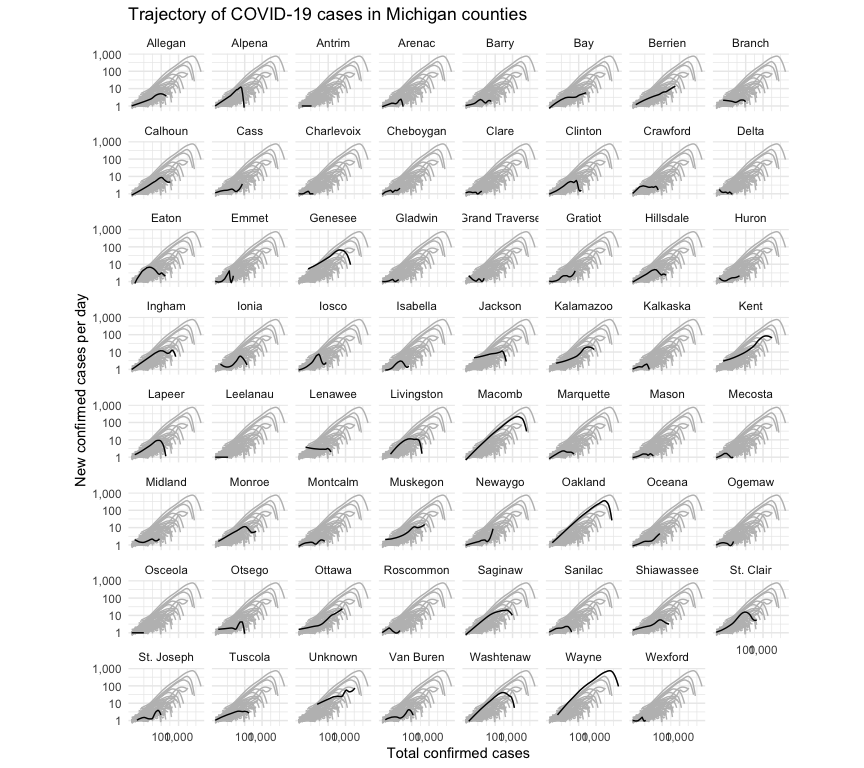

I noticed counties with protests had a double-hump shape.  I wanted to compare this shape with other counties in the same state.


```
## ── Attaching packages ──────────────────────────────────────────────── tidyverse 1.3.0 ──
```

```
## ✔ ggplot2 3.2.1     ✔ purrr   0.3.3
## ✔ tibble  2.1.3     ✔ dplyr   0.8.5
## ✔ tidyr   1.0.2     ✔ stringr 1.4.0
## ✔ readr   1.3.1     ✔ forcats 0.5.0
```

```
## ── Conflicts ─────────────────────────────────────────────────── tidyverse_conflicts() ──
## ✖ dplyr::filter() masks stats::filter()
## ✖ dplyr::lag()    masks stats::lag()
```

```
## 
## Attaching package: 'scales'
```

```
## The following object is masked from 'package:purrr':
## 
##     discard
```

```
## The following object is masked from 'package:readr':
## 
##     col_factor
```

## Loading data


```r
covidByCounty <- loadCovidDataByGeo("US_COUNTY")
```

## Michigan


```r
plotData <- covidByCounty %>%
  dplyr::filter(us_state=="Michigan")
```


```r
ggplot(plotData, aes(x=cases, y=smoothed, group = state)) +
    geom_line(data = plotData %>% rename(group = county),
              aes(x = cases, y = smoothed, group = group), color = "grey") +
    geom_line(aes(y = smoothed), color = "black") +
    scale_x_log10(label = comma, breaks = c(100, 1000, 100000)) + 
    scale_y_log10(label = comma) +
    coord_equal() +
    labs(x = 'Total confirmed cases',
         y = 'New confirmed cases per day',
         title = 'Trajectory of COVID-19 cases in Michigan counties') +
    facet_wrap(~ county) +
    theme_minimal()
```

<!-- -->


## California


```r
plotData <- covidByCounty %>%
  dplyr::filter(us_state=="California")
```


```r
ggplot(plotData, aes(x=cases, y=smoothed, group = state)) +
    geom_line(data = plotData %>% rename(group = county),
              aes(x = cases, y = smoothed, group = group), color = "grey") +
    geom_line(aes(y = smoothed), color = "black") +
    scale_x_log10(label = comma, breaks = c(100, 1000, 100000)) + 
    scale_y_log10(label = comma) +
    coord_equal() +
    labs(x = 'Total confirmed cases',
         y = 'New confirmed cases per day',
         title = 'Trajectory of COVID-19 cases in California counties') +
    facet_wrap(~ county) +
    theme_minimal()
```

<!-- -->
