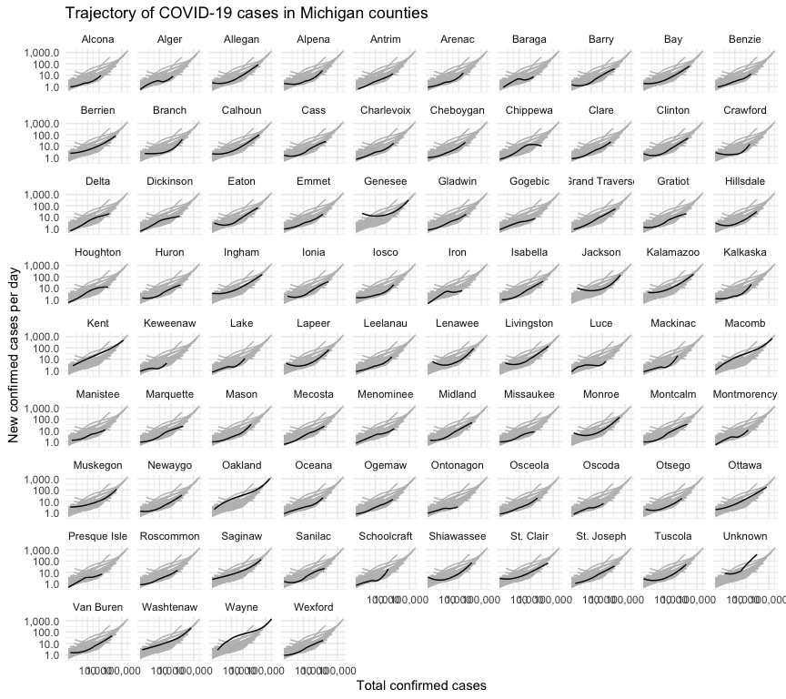

Sure, we see multi-peak (double-hump) infections at the national or state level,
but do they happen in small geographic regions?  It's possible that after the
first wave, people have some herd immunity and improve their safety practices
to prevent a second wave.  County level data helps us answer this-- still not
as granular as I'd like but better than state level data.


```
## ── Attaching packages ─────────────────────────────────────── tidyverse 1.3.1 ──
```

```
## ✓ ggplot2 3.3.5     ✓ purrr   0.3.4
## ✓ tibble  3.1.3     ✓ dplyr   1.0.7
## ✓ tidyr   1.1.4     ✓ stringr 1.4.0
## ✓ readr   2.1.1     ✓ forcats 0.5.1
```

```
## ── Conflicts ────────────────────────────────────────── tidyverse_conflicts() ──
## x dplyr::filter() masks stats::filter()
## x dplyr::lag()    masks stats::lag()
```

```
## 
## Attaching package: 'scales'
```

```
## The following object is masked from 'package:purrr':
## 
##     discard
```

```
## The following object is masked from 'package:readr':
## 
##     col_factor
```

## Loading data


```r
covidByCounty <- loadCovidDataByGeo("US_COUNTY", 1.0)
```

```
## Rows: 2122136 Columns: 6
```

```
## ── Column specification ────────────────────────────────────────────────────────
## Delimiter: ","
## chr  (3): county, state, fips
## dbl  (2): cases, deaths
## date (1): date
```

```
## 
## ℹ Use `spec()` to retrieve the full column specification for this data.
## ℹ Specify the column types or set `show_col_types = FALSE` to quiet this message.
```

## Steep increase counties

Counties that ever hit 1,000 new cases per day.

```r
steepIncrease <- covidByCounty %>% dplyr::filter(newCasesPerDay > 10000) %>% dplyr::filter(state != "_ALL_")
steepIncreaseNames <- unique(steepIncrease$state)
steepIncreaseNames
```

```
##  [1] "Arizona: Maricopa"          "California: Alameda"       
##  [3] "California: Los Angeles"    "California: Orange"        
##  [5] "California: Riverside"      "California: Sacramento"    
##  [7] "California: San Bernardino" "California: San Diego"     
##  [9] "California: Santa Clara"    "Connecticut: Fairfield"    
## [11] "Florida: Brevard"           "Florida: Broward"          
## [13] "Florida: Duval"             "Florida: Hillsborough"     
## [15] "Florida: Lee"               "Florida: Miami-Dade"       
## [17] "Florida: Orange"            "Florida: Palm Beach"       
## [19] "Florida: Pinellas"          "Florida: Polk"             
## [21] "Florida: Unknown"           "Georgia: Unknown"          
## [23] "Illinois: Cook"             "Iowa: Unknown"             
## [25] "Louisiana: Unknown"         "Maryland: Baltimore"       
## [27] "Maryland: Baltimore city"   "Maryland: Montgomery"      
## [29] "Maryland: Prince George's"  "Maryland: Unknown"         
## [31] "Massachusetts: Middlesex"   "Michigan: Oakland"         
## [33] "Michigan: Wayne"            "Nevada: Clark"             
## [35] "New York: New York City"    "North Carolina: Wake"      
## [37] "Oklahoma: Oklahoma"         "Oklahoma: Unknown"         
## [39] "Rhode Island: Providence"   "Rhode Island: Unknown"     
## [41] "Tennessee: Unknown"         "Texas: Bexar"              
## [43] "Texas: Dallas"              "Texas: Harris"             
## [45] "Texas: Hidalgo"             "Texas: Tarrant"            
## [47] "Texas: Travis"              "Utah: Salt Lake"           
## [49] "Washington: King"
```


```r
plotData <- covidByCounty %>%
  dplyr::filter(state %in% steepIncreaseNames)
```


```r
ggplot(plotData, aes(x=cases, y=smoothed, group = state)) +
    geom_line(data = plotData %>% rename(group = state),
              aes(x = cases, y = smoothed, group = group), color = "grey") +
    geom_line(aes(y = smoothed), color = "black") +
    scale_x_log10(label = comma, breaks = c(100, 1000, 100000)) + 
    scale_y_log10(label = comma) +
    coord_equal() +
    labs(x = 'Total confirmed cases',
         y = 'New confirmed cases per day',
         title = 'Trajectory of COVID-19 cases in steep increase counties') +
    facet_wrap(~ state) +
    theme_minimal()
```

<!-- -->

## New York


```r
plotData <- covidByCounty %>%
  dplyr::filter(us_state=="New York")
```


```r
ggplot(plotData, aes(x=cases, y=smoothed, group = state)) +
    geom_line(data = plotData %>% rename(group = county),
              aes(x = cases, y = smoothed, group = group), color = "grey") +
    geom_line(aes(y = smoothed), color = "black") +
    scale_x_log10(label = comma, breaks = c(100, 1000, 100000)) + 
    scale_y_log10(label = comma) +
    coord_equal() +
    labs(x = 'Total confirmed cases',
         y = 'New confirmed cases per day',
         title = 'Trajectory of COVID-19 cases in New York counties') +
    facet_wrap(~ county) +
    theme_minimal()
```

<!-- -->

## New Jersey


```r
plotData <- covidByCounty %>%
  dplyr::filter(us_state=="New Jersey")
```


```r
ggplot(plotData, aes(x=cases, y=smoothed, group = state)) +
    geom_line(data = plotData %>% rename(group = county),
              aes(x = cases, y = smoothed, group = group), color = "grey") +
    geom_line(aes(y = smoothed), color = "black") +
    scale_x_log10(label = comma, breaks = c(100, 1000, 100000)) + 
    scale_y_log10(label = comma) +
    coord_equal() +
    labs(x = 'Total confirmed cases',
         y = 'New confirmed cases per day',
         title = paste('Trajectory of COVID-19 cases in', 'New Jersey', 'counties')) +
    facet_wrap(~ county) +
    theme_minimal()
```

<!-- -->

## Ohio


```r
plotData <- covidByCounty %>%
  dplyr::filter(us_state=="Ohio")
```


```r
ggplot(plotData, aes(x=cases, y=smoothed, group = state)) +
    geom_line(data = plotData %>% rename(group = county),
              aes(x = cases, y = smoothed, group = group), color = "grey") +
    geom_line(aes(y = smoothed), color = "black") +
    scale_x_log10(label = comma, breaks = c(100, 1000, 100000)) + 
    scale_y_log10(label = comma) +
    coord_equal() +
    labs(x = 'Total confirmed cases',
         y = 'New confirmed cases per day',
         title = paste('Trajectory of COVID-19 cases in', 'Ohio', 'counties')) +
    facet_wrap(~ county) +
    theme_minimal()
```

<!-- -->

## Michigan


```r
plotData <- covidByCounty %>%
  dplyr::filter(us_state=="Michigan")
```


```r
ggplot(plotData, aes(x=cases, y=smoothed, group = state)) +
    geom_line(data = plotData %>% rename(group = county),
              aes(x = cases, y = smoothed, group = group), color = "grey") +
    geom_line(aes(y = smoothed), color = "black") +
    scale_x_log10(label = comma, breaks = c(100, 1000, 100000)) + 
    scale_y_log10(label = comma) +
    coord_equal() +
    labs(x = 'Total confirmed cases',
         y = 'New confirmed cases per day',
         title = 'Trajectory of COVID-19 cases in Michigan counties') +
    facet_wrap(~ county) +
    theme_minimal()
```

<!-- -->


## Illinois


```r
plotData <- covidByCounty %>%
  dplyr::filter(us_state=="Illinois")
```


```r
ggplot(plotData, aes(x=cases, y=smoothed, group = state)) +
    geom_line(data = plotData %>% rename(group = county),
              aes(x = cases, y = smoothed, group = group), color = "grey") +
    geom_line(aes(y = smoothed), color = "black") +
    scale_x_log10(label = comma, breaks = c(100, 1000, 100000)) + 
    scale_y_log10(label = comma) +
    coord_equal() +
    labs(x = 'Total confirmed cases',
         y = 'New confirmed cases per day',
         title = 'Trajectory of COVID-19 cases in Illinois counties') +
    facet_wrap(~ county) +
    theme_minimal()
```

<!-- -->

## California


```r
plotData <- covidByCounty %>%
  dplyr::filter(us_state=="California")
```


```r
ggplot(plotData, aes(x=cases, y=smoothed, group = state)) +
    geom_line(data = plotData %>% rename(group = county),
              aes(x = cases, y = smoothed, group = group), color = "grey") +
    geom_line(aes(y = smoothed), color = "black") +
    scale_x_log10(label = comma, breaks = c(100, 1000, 100000)) + 
    scale_y_log10(label = comma) +
    coord_equal() +
    labs(x = 'Total confirmed cases',
         y = 'New confirmed cases per day',
         title = 'Trajectory of COVID-19 cases in California counties') +
    facet_wrap(~ county) +
    theme_minimal()
```

<!-- -->

## Louisiana


```r
plotData <- covidByCounty %>%
  dplyr::filter(us_state=="Louisiana")
```


```r
ggplot(plotData, aes(x=cases, y=smoothed, group = state)) +
    geom_line(data = plotData %>% rename(group = county),
              aes(x = cases, y = smoothed, group = group), color = "grey") +
    geom_line(aes(y = smoothed), color = "black") +
    scale_x_log10(label = comma, breaks = c(100, 1000, 10000)) + 
    scale_y_log10(label = comma) +
    coord_equal() +
    labs(x = 'Total confirmed cases',
         y = 'New confirmed cases per day',
         title = 'Trajectory of COVID-19 cases in Louisiana counties') +
    facet_wrap(~ county) +
    theme_minimal()
```

<!-- -->

## Tennessee

No protests against lockdown in Tennessee but I am curious how it looks.  I removed Bledsoe county because it seems to have a data error (100 million new cases on one day).


```r
plotData <- covidByCounty %>%
  dplyr::filter(us_state=="Tennessee") %>% filter(! (county %in% c("Bledsoe", "Trousdale")))
```


```r
ggplot(plotData, aes(x=cases, y=smoothed, group = state)) +
    geom_line(data = plotData %>% rename(group = county),
              aes(x = cases, y = smoothed, group = group), color = "grey") +
    geom_line(aes(y = smoothed), color = "black") +
    scale_x_log10(label = comma, breaks = c(100, 1000, 10000)) + 
    scale_y_log10(label = comma) +
    coord_equal() +
    labs(x = 'Total confirmed cases',
         y = 'New confirmed cases per day',
         title = 'Trajectory of COVID-19 cases in Tennessee counties') +
    facet_wrap(~ county) +
    theme_minimal()
```

<!-- -->
