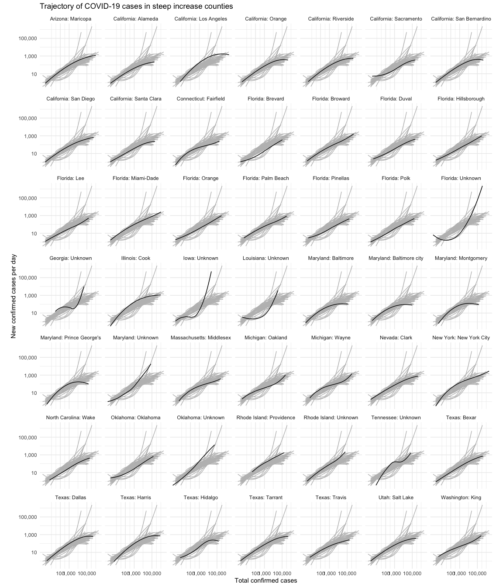
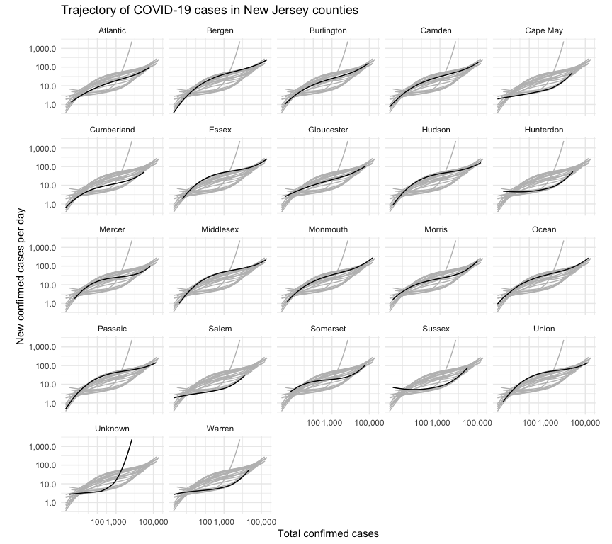

Sure, we see multi-peak (double-hump) infections at the national or state level,
but do they happen in small geographic regions?  It's possible that after the
first wave, people have some herd immunity and improve their safety practices
to prevent a second wave.  County level data helps us answer this-- still not
as granular as I'd like but better than state level data.


```
## ── Attaching packages ────────────────────────────────── tidyverse 1.3.0 ──
```

```
## ✓ ggplot2 3.3.2     ✓ purrr   0.3.3
## ✓ tibble  3.0.4     ✓ dplyr   0.8.5
## ✓ tidyr   1.1.2     ✓ stringr 1.4.0
## ✓ readr   1.3.1     ✓ forcats 0.5.0
```

```
## Warning: package 'ggplot2' was built under R version 3.6.2
```

```
## Warning: package 'tibble' was built under R version 3.6.2
```

```
## Warning: package 'tidyr' was built under R version 3.6.2
```

```
## ── Conflicts ───────────────────────────────────── tidyverse_conflicts() ──
## x dplyr::filter() masks stats::filter()
## x dplyr::lag()    masks stats::lag()
```

```
## Warning: package 'scales' was built under R version 3.6.2
```

```
## 
## Attaching package: 'scales'
```

```
## The following object is masked from 'package:purrr':
## 
##     discard
```

```
## The following object is masked from 'package:readr':
## 
##     col_factor
```

## Loading data


```r
covidByCounty <- loadCovidDataByGeo("US_COUNTY")
```

## Steep increase counties

Counties that ever hit 1,000 new cases per day.

```r
steepIncrease <- covidByCounty %>% dplyr::filter(newCasesPerDay > 1000) %>% dplyr::filter(state != "_ALL_")
steepIncreaseNames <- unique(steepIncrease$state)
steepIncreaseNames
```

```
##   [1] "Alabama: Mobile"             "Alabama: Tuscaloosa"        
##   [3] "Arizona: Maricopa"           "Arizona: Pima"              
##   [5] "Arizona: Yuma"               "California: Alameda"        
##   [7] "California: Contra Costa"    "California: Fresno"         
##   [9] "California: Kern"            "California: Los Angeles"    
##  [11] "California: Monterey"        "California: Orange"         
##  [13] "California: Riverside"       "California: Sacramento"     
##  [15] "California: San Bernardino"  "California: San Diego"      
##  [17] "California: San Joaquin"     "California: Santa Clara"    
##  [19] "California: Solano"          "California: Stanislaus"     
##  [21] "California: Ventura"         "Colorado: El Paso"          
##  [23] "Connecticut: Fairfield"      "Connecticut: Hartford"      
##  [25] "Connecticut: New Haven"      "Florida: Broward"           
##  [27] "Florida: Duval"              "Florida: Hillsborough"      
##  [29] "Florida: Lee"                "Florida: Miami-Dade"        
##  [31] "Florida: Orange"             "Florida: Palm Beach"        
##  [33] "Florida: Pinellas"           "Florida: Polk"              
##  [35] "Georgia: Cobb"               "Georgia: Fulton"            
##  [37] "Georgia: Gwinnett"           "Georgia: Unknown"           
##  [39] "Illinois: Cook"              "Illinois: DuPage"           
##  [41] "Illinois: Kane"              "Illinois: Lake"             
##  [43] "Illinois: Unknown"           "Illinois: Will"             
##  [45] "Indiana: Marion"             "Kansas: Johnson"            
##  [47] "Kansas: Sedgwick"            "Louisiana: Unknown"         
##  [49] "Massachusetts: Bristol"      "Massachusetts: Essex"       
##  [51] "Massachusetts: Middlesex"    "Massachusetts: Suffolk"     
##  [53] "Massachusetts: Worcester"    "Michigan: Chippewa"         
##  [55] "Michigan: Gratiot"           "Michigan: Jackson"          
##  [57] "Michigan: Kent"              "Michigan: Macomb"           
##  [59] "Michigan: Oakland"           "Michigan: Wayne"            
##  [61] "Minnesota: Hennepin"         "Missouri: St. Louis"        
##  [63] "Nebraska: Douglas"           "Nevada: Clark"              
##  [65] "New Jersey: Unknown"         "New Mexico: Bernalillo"     
##  [67] "New York: Nassau"            "New York: New York City"    
##  [69] "New York: Suffolk"           "New York: Westchester"      
##  [71] "North Carolina: Mecklenburg" "North Carolina: Wake"       
##  [73] "North Dakota: Unknown"       "Ohio: Cuyahoga"             
##  [75] "Ohio: Franklin"              "Ohio: Hamilton"             
##  [77] "Ohio: Lorain"                "Ohio: Summit"               
##  [79] "Oklahoma: Oklahoma"          "Oklahoma: Tulsa"            
##  [81] "Pennsylvania: Allegheny"     "Pennsylvania: Philadelphia" 
##  [83] "Puerto Rico: Unknown"        "Rhode Island: Kent"         
##  [85] "Rhode Island: Providence"    "Rhode Island: Unknown"      
##  [87] "South Carolina: Aiken"       "South Carolina: Greenville" 
##  [89] "Tennessee: Davidson"         "Tennessee: Shelby"          
##  [91] "Tennessee: Unknown"          "Texas: Anderson"            
##  [93] "Texas: Bexar"                "Texas: Brazoria"            
##  [95] "Texas: Cameron"              "Texas: Collin"              
##  [97] "Texas: Dallas"               "Texas: Denton"              
##  [99] "Texas: El Paso"              "Texas: Ellis"               
## [101] "Texas: Fort Bend"            "Texas: Guadalupe"           
## [103] "Texas: Harris"               "Texas: Hidalgo"             
## [105] "Texas: Howard"               "Texas: Midland"             
## [107] "Texas: Montgomery"           "Texas: Nueces"              
## [109] "Texas: Orange"               "Texas: Parker"              
## [111] "Texas: Potter"               "Texas: Tarrant"             
## [113] "Texas: Travis"               "Texas: Williamson"          
## [115] "Utah: Salt Lake"             "Utah: Utah"                 
## [117] "Utah: Weber"                 "Washington: King"           
## [119] "Washington: Snohomish"       "Washington: Spokane"        
## [121] "Wisconsin: Milwaukee"        "Wisconsin: Waukesha"
```


```r
plotData <- covidByCounty %>%
  dplyr::filter(state %in% steepIncreaseNames)
```


```r
ggplot(plotData, aes(x=cases, y=smoothed, group = state)) +
    geom_line(data = plotData %>% rename(group = state),
              aes(x = cases, y = smoothed, group = group), color = "grey") +
    geom_line(aes(y = smoothed), color = "black") +
    scale_x_log10(label = comma, breaks = c(100, 1000, 100000)) + 
    scale_y_log10(label = comma) +
    coord_equal() +
    labs(x = 'Total confirmed cases',
         y = 'New confirmed cases per day',
         title = 'Trajectory of COVID-19 cases in steep increase counties') +
    facet_wrap(~ state) +
    theme_minimal()
```

<!-- -->

## New York


```r
plotData <- covidByCounty %>%
  dplyr::filter(us_state=="New York")
```


```r
ggplot(plotData, aes(x=cases, y=smoothed, group = state)) +
    geom_line(data = plotData %>% rename(group = county),
              aes(x = cases, y = smoothed, group = group), color = "grey") +
    geom_line(aes(y = smoothed), color = "black") +
    scale_x_log10(label = comma, breaks = c(100, 1000, 100000)) + 
    scale_y_log10(label = comma) +
    coord_equal() +
    labs(x = 'Total confirmed cases',
         y = 'New confirmed cases per day',
         title = 'Trajectory of COVID-19 cases in New York counties') +
    facet_wrap(~ county) +
    theme_minimal()
```

<!-- -->

## New Jersey


```r
plotData <- covidByCounty %>%
  dplyr::filter(us_state=="New Jersey")
```


```r
ggplot(plotData, aes(x=cases, y=smoothed, group = state)) +
    geom_line(data = plotData %>% rename(group = county),
              aes(x = cases, y = smoothed, group = group), color = "grey") +
    geom_line(aes(y = smoothed), color = "black") +
    scale_x_log10(label = comma, breaks = c(100, 1000, 100000)) + 
    scale_y_log10(label = comma) +
    coord_equal() +
    labs(x = 'Total confirmed cases',
         y = 'New confirmed cases per day',
         title = paste('Trajectory of COVID-19 cases in', 'New Jersey', 'counties')) +
    facet_wrap(~ county) +
    theme_minimal()
```

<!-- -->

## Ohio


```r
plotData <- covidByCounty %>%
  dplyr::filter(us_state=="Ohio")
```


```r
ggplot(plotData, aes(x=cases, y=smoothed, group = state)) +
    geom_line(data = plotData %>% rename(group = county),
              aes(x = cases, y = smoothed, group = group), color = "grey") +
    geom_line(aes(y = smoothed), color = "black") +
    scale_x_log10(label = comma, breaks = c(100, 1000, 100000)) + 
    scale_y_log10(label = comma) +
    coord_equal() +
    labs(x = 'Total confirmed cases',
         y = 'New confirmed cases per day',
         title = paste('Trajectory of COVID-19 cases in', 'Ohio', 'counties')) +
    facet_wrap(~ county) +
    theme_minimal()
```

<!-- -->

## Michigan


```r
plotData <- covidByCounty %>%
  dplyr::filter(us_state=="Michigan")
```


```r
ggplot(plotData, aes(x=cases, y=smoothed, group = state)) +
    geom_line(data = plotData %>% rename(group = county),
              aes(x = cases, y = smoothed, group = group), color = "grey") +
    geom_line(aes(y = smoothed), color = "black") +
    scale_x_log10(label = comma, breaks = c(100, 1000, 100000)) + 
    scale_y_log10(label = comma) +
    coord_equal() +
    labs(x = 'Total confirmed cases',
         y = 'New confirmed cases per day',
         title = 'Trajectory of COVID-19 cases in Michigan counties') +
    facet_wrap(~ county) +
    theme_minimal()
```

<!-- -->


## Illinois


```r
plotData <- covidByCounty %>%
  dplyr::filter(us_state=="Illinois")
```


```r
ggplot(plotData, aes(x=cases, y=smoothed, group = state)) +
    geom_line(data = plotData %>% rename(group = county),
              aes(x = cases, y = smoothed, group = group), color = "grey") +
    geom_line(aes(y = smoothed), color = "black") +
    scale_x_log10(label = comma, breaks = c(100, 1000, 100000)) + 
    scale_y_log10(label = comma) +
    coord_equal() +
    labs(x = 'Total confirmed cases',
         y = 'New confirmed cases per day',
         title = 'Trajectory of COVID-19 cases in Illinois counties') +
    facet_wrap(~ county) +
    theme_minimal()
```

<!-- -->

## California


```r
plotData <- covidByCounty %>%
  dplyr::filter(us_state=="California")
```


```r
ggplot(plotData, aes(x=cases, y=smoothed, group = state)) +
    geom_line(data = plotData %>% rename(group = county),
              aes(x = cases, y = smoothed, group = group), color = "grey") +
    geom_line(aes(y = smoothed), color = "black") +
    scale_x_log10(label = comma, breaks = c(100, 1000, 100000)) + 
    scale_y_log10(label = comma) +
    coord_equal() +
    labs(x = 'Total confirmed cases',
         y = 'New confirmed cases per day',
         title = 'Trajectory of COVID-19 cases in California counties') +
    facet_wrap(~ county) +
    theme_minimal()
```

<!-- -->

## Louisiana


```r
plotData <- covidByCounty %>%
  dplyr::filter(us_state=="Louisiana")
```


```r
ggplot(plotData, aes(x=cases, y=smoothed, group = state)) +
    geom_line(data = plotData %>% rename(group = county),
              aes(x = cases, y = smoothed, group = group), color = "grey") +
    geom_line(aes(y = smoothed), color = "black") +
    scale_x_log10(label = comma, breaks = c(100, 1000, 10000)) + 
    scale_y_log10(label = comma) +
    coord_equal() +
    labs(x = 'Total confirmed cases',
         y = 'New confirmed cases per day',
         title = 'Trajectory of COVID-19 cases in Louisiana counties') +
    facet_wrap(~ county) +
    theme_minimal()
```

<!-- -->

## Tennessee

No protests against lockdown in Tennessee but I am curious how it looks.  I removed Bledsoe county because it seems to have a data error (100 million new cases on one day).


```r
plotData <- covidByCounty %>%
  dplyr::filter(us_state=="Tennessee") %>% filter(! (county %in% c("Bledsoe", "Trousdale")))
```


```r
ggplot(plotData, aes(x=cases, y=smoothed, group = state)) +
    geom_line(data = plotData %>% rename(group = county),
              aes(x = cases, y = smoothed, group = group), color = "grey") +
    geom_line(aes(y = smoothed), color = "black") +
    scale_x_log10(label = comma, breaks = c(100, 1000, 10000)) + 
    scale_y_log10(label = comma) +
    coord_equal() +
    labs(x = 'Total confirmed cases',
         y = 'New confirmed cases per day',
         title = 'Trajectory of COVID-19 cases in Tennessee counties') +
    facet_wrap(~ county) +
    theme_minimal()
```

<!-- -->
