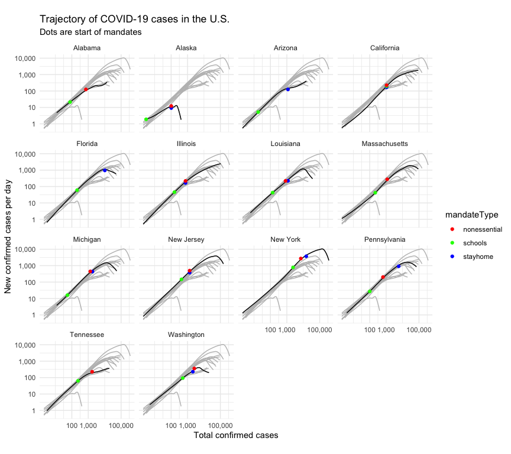

This combines data on state mandates with cases to help visualize the affect, if any, of these mandates on the growth of cases.


```
## ── Attaching packages ──────────────────────────────────────────────── tidyverse 1.3.0 ──
```

```
## ✔ ggplot2 3.2.1     ✔ purrr   0.3.3
## ✔ tibble  2.1.3     ✔ dplyr   0.8.5
## ✔ tidyr   1.0.2     ✔ stringr 1.4.0
## ✔ readr   1.3.1     ✔ forcats 0.5.0
```

```
## ── Conflicts ─────────────────────────────────────────────────── tidyverse_conflicts() ──
## ✖ dplyr::filter() masks stats::filter()
## ✖ dplyr::lag()    masks stats::lag()
```

```
## 
## Attaching package: 'scales'
```

```
## The following object is masked from 'package:purrr':
## 
##     discard
```

```
## The following object is masked from 'package:readr':
## 
##     col_factor
```

## Loading data


```r
covidByStateSmoothed <- loadCovidDataBy2Geo("US")
```


```r
mandatesByState <- read.csv2('https://raw.githubusercontent.com/jeanimal/covid_log_log_diff/master/covid_log_log_diff/data/covid_state_mandates.csv', sep=",", stringsAsFactors=FALSE, na.strings=c(""))
mandatesByState$stayhome <- as.Date(mandatesByState$stayhome)
mandatesByState$schools <- as.Date(mandatesByState$schools)
mandatesByState$nonessential <- as.Date(mandatesByState$nonessential)
mandatesByState$travel <- as.Date(mandatesByState$travel)
```

## Plot helpers


```r
# joinMandatesWithCases joins mandateByState with the case data in covidByState
# It uses the state and date in covidByState for the state at mandateColName date.
# mandatesByState should have columns:
# - state
# - [mandateColName]
# covidByState should have columns:
# - state
# - date
# - whatever case info you want
joinMandatesWithCases <- function(mandatesByState, mandateColName, covidByState) {
  mandatesByStateWithCases <- mandatesByState[, c("state", mandateColName)]
  # The c() function messes up evaluation so I use a hacky renaming.
  names(mandatesByStateWithCases)[[2]] <- "date"
  mandatesByStateWithCases <- mandatesByStateWithCases %>% left_join(covidByState, by=c("state", "date"))
  mandatesByStateWithCases$mandateType <- mandateColName
  mandatesByStateWithCases
}
```


## Plots

The dot for the start of a mandate is plotted by looking up the number of cases and new
cases on that day.

In general, we would expect a delay of 1-2 weeks between the date an order starts and a change in cases because the virus incubation period is at least that long.

## Temporary

Temporary: Remove states I do not have any mandate data for.

```r
background_states <- c("New York", "New Jersey", "California", "Michigan", "Louisiana", "Florida", "Massachusetts", "Illinois", "Pennsylvania", "Washington")
covidByStateSmoothed <- covidByStateSmoothed %>%
filter(state %in% c("Alabama", "Alaska", "Arizona", "Tennessee", "New York", background_states))
```


## All mandates

I made a grid of state plots of covid new cases (y axis) vs. total covid cases (x axis).  On each plot, the dot is the start of a mandate, such as "stay at home".  *If a dot does not appear for a state, it means the state has not set that mandate.*

Recall that a straight line up and to the right represents exponential growth.  We would expect that the line starts flattening after the start of a mandate but with a delay of 1-2 weeks because the virus incubation period is at least that long.  

My summary: It seems rare that a state's covid case line plot flattens after a mandate.  Tennessee and NY have that pattern but not the others.


```
## Warning: Removed 5 rows containing missing values (geom_point).
```

<!-- -->


